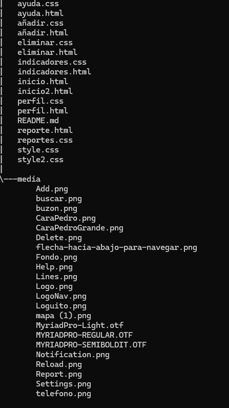

# Descripcion

La página web consta de dos secciones principales las cuales son:

1. Realizar licitaciones públicas y privadas de varios nichos de negocios.
2. Hace entrega formal del primer flujo de entrada para la parte adminstrativa.

# Tecnologías utilizadas

* HTML5
* CSS
* Tipos de letras media (MyriadPro-Light, MYRIADPRO-REGULAR, MYRIADPRO-SEMIBOLDIT)

# Estructura del proyecto

En la imagen anterior podemos apreciar la forma en que estructuramos nuestro proyecto 
de manera simple usando  1 carpeta para almacenar los archivos que hacen referencia a imágenes y los tipos de letras utilizados en la maquetación.

# Caracteristicas 

* Archivos `index.html`: estos contienen en forma de linea de código la estructura de nuestro código.

* Archivos `styles.css`: estos contienen diversos estilos que dan un diseño específico a nuestra página.

* Carpeta`media/`: Contiene todas las imágenes y tipos de letra usados en nuestro proyecto.

# Diseño

* Este es un diseño responsive que cuenta con las medidas (viewport width),(viewport height) usandolo de manera general en cada una de las páginas. 

* Se aplico posiciones absolutas, relativas en todas las páginas.

* Creamos menus desplegables para dar las opciones al usuario y así da una mejor experiencia al usuario.

# Instrucciones

1. Clonar repositorio cargado en GitHub.
2. Abrir en la nube el archivo `index.html` en un navegador web.

# Desarrollado por:

Este proyecto fue desarrollado por Brayan Stiven Maldonado Ortega y Freiler Aleiro Ortega Estupiñan como estudiantes de campusland para el filtro de HTML y CSS.
